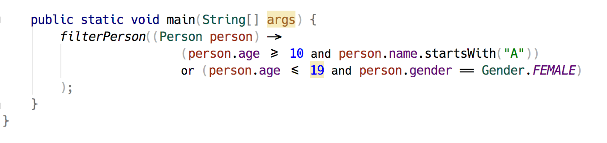

# Jack

Jack is a experemintal font.

Jack is the [Haack](https://github.com/ignatov/Haack) fork with programming ligatures which based on [Hack](http://sourcefoundry.org/hack/).

### Code examples

#### Java

